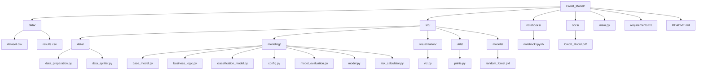
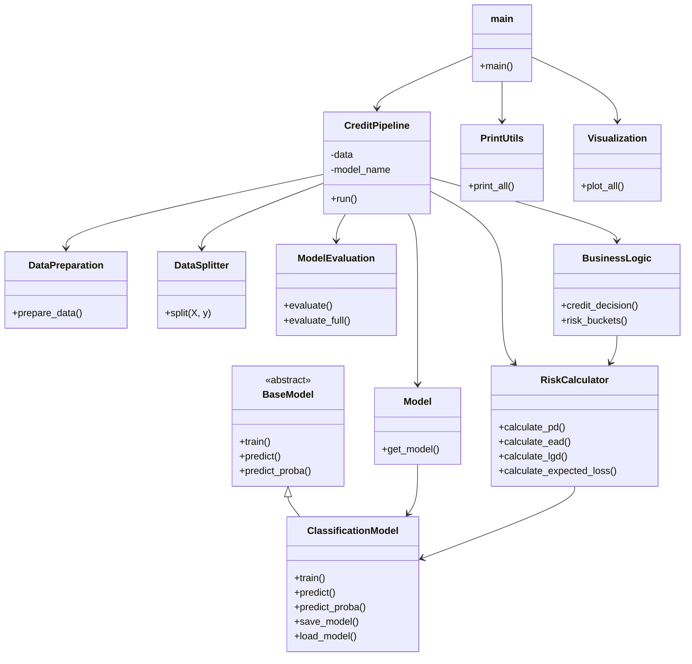

# Credit Model
### Credit Models project

**Author:** 
  - José Armando Melchor Soto
  - Rolando Fortanell Canedo
  - David Campos Ambriz 


**Course:** Credit Models  
**Institution:** ITESO  

---

## Table of Contents


---
## Overview

---

## Architecture

### Project Structure


### Functional Architecture

### OOP Architecture


### Loan Lifecycle


### Flow Diagram
flowchart LR

    %% ======================
    %% INPUT
    %% ======================
    A[Raw Data] --> B[Data Preparation]

    %% ======================
    %% DATA
    %% ======================
    B --> C[X, y]
    C --> D[Train/Test Split]

    D --> Xtr[X_train]
    D --> Xte[X_test]
    D --> Ytr[y_train]
    D --> Yte[y_test]

    %% ======================
    %% MODEL
    %% ======================
    Xtr --> E[Model Selection]
    E --> F[Train Model]

    %% ======================
    %% PREDICTIONS
    %% ======================
    F --> G[Predict y_pred (Test)]
    F --> H[Predict PD (Test)]
    F --> I[Predict PD (Train)]

    %% ======================
    %% EVALUATION
    %% ======================
    G --> J[Model Evaluation]
    H --> J
    I --> J
    Yte --> J
    Ytr --> J

    %% ======================
    %% RISK
    %% ======================
    F --> K[PD Full Dataset]
    K --> L[EAD]
    K --> M[LGD]

    K --> N[Expected Loss]
    L --> N
    M --> N

    %% ======================
    %% BUSINESS LOGIC
    %% ======================
    K --> O[Credit Decision]
    K --> P[Risk Buckets]

    %% ======================
    %% OUTPUT
    %% ======================
    N --> Q[Final Dataset]
    O --> Q
    P --> Q

    %% ======================
    %% SAVE
    %% ======================
    F --> R[Save Model]

    %% ======================
    %% RESULTS
    %% ======================
    J --> S[Results Metrics]
    Q --> T[Enriched Dataset]


---


## Installation

```bash
# 1. Clone the repository
git clone https://github.com/ppmelch/Credit_Model.git
cd Credit_Model

# 2. Create and activate a virtual environment
python -m venv .venv
source .venv/bin/activate      # macOS / Linux
.venv\Scripts\activate         # Windows

# 3. Install dependencies
pip install -r requirements.txt
```

---

## Usage

---

## Results

---

## Discussion

---

## Assumptions

---

## Limitations

---


## Conclusions

---


## Output

---


## Documentation

The full project report is available at:

- [Credit Model Report](docs/Credit_Model.pdf)

---

## License

This project is licensed under the **MIT License** — see [LICENSE](LICENSE) for details.
