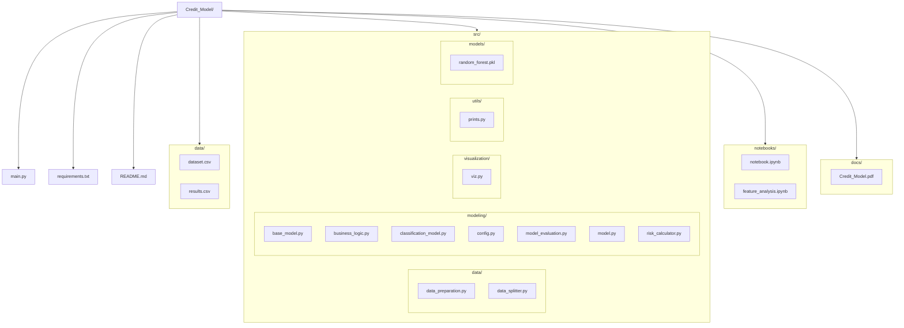
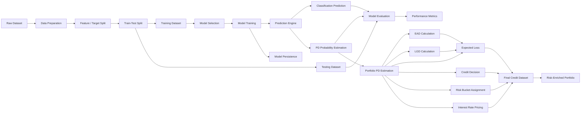
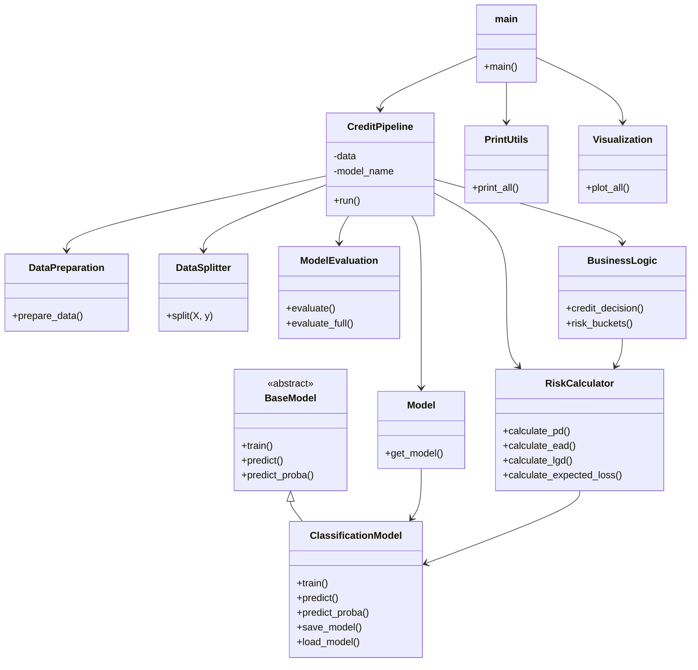
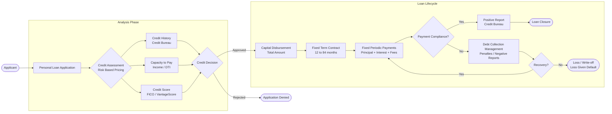

# Credit Model
### Credit Models Project
 
**Authors:**
- José Armando Melchor Soto — 745697
- Rolando Fortanell Canedo — 744872
- David Campos Ambriz — 7444435
 
**Course:** Credit Models

**Institution:** ITESO Universidad Jesuita de Guadalajara

**Date:** April 13, 2026
 
---
 
## Table of Contents
 
- [Overview](#overview)
- [Architecture](#architecture)
  - [Project Structure](#project-structure)
  - [Functional Architecture](#functional-architecture)
  - [OOP Architecture](#oop-architecture)
  - [Loan Lifecycle](#loan-lifecycle)
  - [Flow Diagram](#flow-diagram)
- [Dataset](#dataset)
- [Methodology](#methodology)
- [Results](#results)
- [Limitations & Assumptions](#limitations--assumptions)
- [Conclusions](#conclusions)
- [Installation](#installation)
- [Usage](#usage)
- [Output](#output)
- [Documentation](#documentation)
- [License](#license)
 
---
 
## Overview
 
The continued expansion of unsecured personal lending in the United States — with outstanding balances reaching **$276 billion** by the end of 2025 — presents financial institutions with a significant risk management challenge. In the absence of collateral, borrower evaluation becomes the primary mechanism for controlling credit losses.
 
This project develops a **comprehensive credit model for unsecured personal loans** by integrating:
 
- Business model analysis of the personal loan product
- Interest rate formation decomposition (base rate, inflation premium, credit risk premium, liquidity premium, administrative costs, and profit margin)
- A machine learning credit risk framework built as a modular OOP pipeline in Python
 
A **Random Forest classifier** was selected as the final predictive model to estimate borrower-level **Probability of Default (PD)**, integrated with **Loss Given Default (LGD)** and **Exposure at Default (EAD)** to calculate **Expected Loss (EL)** across the portfolio. These outputs feed into a business logic layer supporting approval decisions, risk segmentation, and risk-based pricing.
 
---
 
## Architecture
 
### Project Structure
 

 
### Functional Architecture
 

 
### OOP Architecture
 

 
### Loan Lifecycle
 

 
---
 
## Dataset
 
The model was trained on the **Realistic Loan Approval Dataset (US & Canada)** obtained from [Kaggle](https://www.kaggle.com/), filtered to retain only **Personal Loan** records.
 
| Property | Value |
|---|---|
| Raw observations | ~50,000 records |
| Post-filter observations | **17,523 records** |
| Features (post-preprocessing) | 19 columns |
| Target variable | `loan_status` (0 = Rejected, 1 = Approved) |
| Class distribution | ~52% Approved / ~48% Rejected |
| Train / Test split | 75% / 25% (stratified) |
 
**Selected features for modeling (8 variables):**
 
| Category | Variables |
|---|---|
| Creditworthiness & history | `credit_score`, `credit_history_years`, `delinquencies_last_2yrs`, `defaults_on_file` |
| Repayment capacity | `debt_to_income_ratio`, `payment_to_income_ratio` |
| Borrower stability | `years_employed`, `loan_intent_Education` |
 
Feature selection was validated through correlation analysis, XGBoost gain-based importance, and SHAP interpretability analysis.
 
---
 
## Methodology
 
### Interest Rate Decomposition
 
The lending rate is decomposed into six components reflecting the full cost and risk structure of unsecured personal loans in the U.S. market:
 
| Component | Description |
|---|---|
| **Base Rate** | Federal funds rate (FOMC reference); stood at 3.64% effective average (Q1 2026) |
| **Inflation Premium** | Compensation for purchasing power erosion; CPI-U at 2.7% (2025), core inflation 2.5% (Feb 2026) |
| **Credit Risk Premium** | Risk-based pricing adjustment; spread of ~930 bps vs. credit cards and ~400 bps vs. auto loans |
| **Liquidity Premium** | Opportunity cost of committing long-term capital; proxied by industry NIM ~3.25–3.26% |
| **Administrative Costs** | Origination, servicing, and collection costs; ~2% annually based on FDIC efficiency ratio of 56.2% |
| **Profit Margin** | Target return; anchored to industry ROA of ~1.16% (2025) |
 
### Credit Risk Framework
 
The pipeline implements the standard Expected Loss formula:
 
```
EL = PD × LGD × EAD
```
 
Where:
- **PD** — Probability of Default, estimated borrower-level from the Random Forest classifier
- **LGD** — Loss Given Default, set at a constant **45%** (Basel II convention for unsecured loans)
- **EAD** — Exposure at Default, estimated as the **full outstanding loan amount**
 
### Model
 
A **Random Forest classifier** was selected as the final model, providing a balance of predictive power and interpretability. Feature importance was validated using XGBoost (gradient boosting) with the following hyperparameters:
 
| Parameter | Value |
|---|---|
| `objective` | `binary:logistic` |
| `n_estimators` | 250 |
| `max_depth` | 2 |
| `learning_rate` | 0.01 |
| `subsample` | 0.8 |
| `colsample_bytree` | 0.8 |
| `eval_metric` | `logloss` |
| `random_state` | 42 |
 
---
 
## Results
 
### Model Performance
 
| Metric | Value |
|---|---|
| **Test ROC-AUC** | **0.93** |
| Train ROC-AUC | 0.94 |
| Accuracy | 84.3% |
| Precision | 81.7% |
| Recall | 86.7% |
| F1-Score | 84.2% |
 
The minimal gap between train (0.94) and test (0.93) ROC-AUC indicates strong generalization with minimal overfitting.
 
### Key Findings
 
**ROC-AUC** — Both training and test ROC curves show clear separation from the random classification baseline, confirming strong discriminatory power between defaulting and non-defaulting borrowers.
 
**Confusion Matrix** — The majority of observations are correctly classified in both datasets. Misclassifications are concentrated among borderline borrower profiles, which is expected in unsecured lending where risk signals can overlap.
 
**Calibration Curve** — Predicted PD values align closely with observed default frequencies. Minor deviations appear at the extremes (slight overestimation for low-risk, slight underestimation for highest-risk segments), consistent with stable probability estimation suitable for downstream financial applications.
 
**PD Distribution** — Approved applicants concentrate in lower predicted PD ranges; denied applicants shift toward higher values. The separation is consistent across both training and test sets, validating the model's risk-ranking capability.
 
### Risk Bucket Analysis
 
Borrowers are segmented into equally-sized risk buckets ranked by increasing PD. Across all buckets:
 
- **Predicted PD** increases monotonically from Low Risk → Very High Risk
- **Expected Loss** follows the same upward trend, reflecting direct PD-to-exposure linkage
- **Assigned interest rates** increase progressively across buckets, consistent with risk-based pricing principles
 
This confirms internal consistency between the predictive engine, expected loss estimation, and pricing decisions.
 
---
 
## Limitations & Assumptions
 
| Limitation | Detail |
|---|---|
| Static dataset | No temporal dimension; cannot capture macroeconomic drift or borrower behavior evolution over time |
| Constant LGD | Fixed at 45% across all borrowers; ignores borrower-specific recovery rates and economic conditions |
| EAD simplification | Full loan amount assumed outstanding at default; does not account for amortization or early repayment |
| Single-product scope | Filtered to Personal Loan only; results should not be extrapolated to revolving products |
| Simulated data | Dataset approximates real lending behavior but lacks the complexity of actual banking portfolios |
 
### Future Improvements
 
- Integration of **MLFlow** for experiment tracking, model versioning, and reproducible deployment workflows
- Development of an **interactive underwriting dashboard** for real-time risk visualization and pricing recommendations
- Implementation of **feature drift and prediction drift monitoring** for model performance surveillance in production
- Incorporation of **macroeconomic stress testing** and scenario analysis for forward-looking expected loss estimation
- Dynamic **borrower-specific LGD and EAD models** to replace constant assumptions
 
---
 
## Conclusions
 
The framework demonstrates that machine learning methods and traditional financial risk theory can function as complementary tools when integrated into a unified analytical pipeline. Key takeaways:
 
1. The predictive model achieves a **test ROC-AUC of 0.93** with balanced precision and recall, demonstrating reliable discriminatory power across different borrower profiles.
2. By linking PD estimates to LGD and EAD, the system produces **economically meaningful Expected Loss outputs** rather than simple binary classifications.
3. The **risk-based pricing logic** — where the credit risk premium is directly linked to each borrower's estimated PD — ensures that higher-risk borrowers receive proportionally higher borrowing costs, aligning expected return with expected credit exposure.
4. The **risk bucket segmentation** confirms internal consistency: PD, expected loss, and assigned interest rates all increase monotonically across risk categories.
5. The modular OOP pipeline design supports scalability, reproducibility, and potential extension to production-grade underwriting systems.
 
---
 
## Installation
 
```bash
# 1. Clone the repository
git clone https://github.com/ppmelch/Credit_Model.git
cd Credit_Model
 
# 2. Create and activate a virtual environment
python -m venv .venv
source .venv/bin/activate      # macOS / Linux
.venv\Scripts\activate         # Windows
 
# 3. Install dependencies
pip install -r requirements.txt
```
 
---
 
## Usage
 
```bash
python main.py
```
 
The pipeline will automatically:
1. Load and prepare the dataset
2. Split features and target, then apply train/test split
3. Train the Random Forest classifier
4. Evaluate model performance (ROC-AUC, accuracy, precision, recall, F1)
5. Estimate borrower-level PD, EAD, LGD, and Expected Loss
6. Apply business logic for credit decisions, risk bucket assignment, and interest rate pricing
7. Export the risk-enriched portfolio to `data/results.csv`
 
---
 
## Output
 
The pipeline generates the following outputs:
 
| Output | Description |
|---|---|
| `data/results.csv` | Risk-enriched portfolio with PD, EAD, LGD, EL, credit decision, risk bucket, and assigned interest rate per borrower |
| `models/random_forest.pkl` | Serialized trained Random Forest model |
| Performance metrics | Printed to console: ROC-AUC, accuracy, precision, recall, F1-score |
| Visualizations | ROC curves, confusion matrices, calibration curves, PD distributions, risk bucket charts |
 
---
 
## Documentation
 
The full project report is available at:
 
- [Credit Model Report](docs/Credit_Model.pdf)
 
---
 
## License
 
This project is licensed under the **MIT License** — see [LICENSE](LICENSE) for details.
