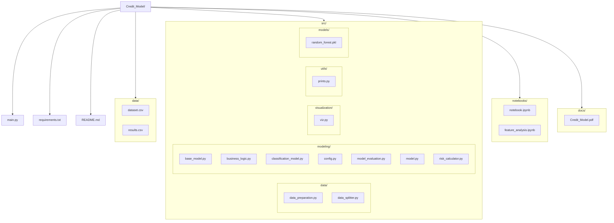
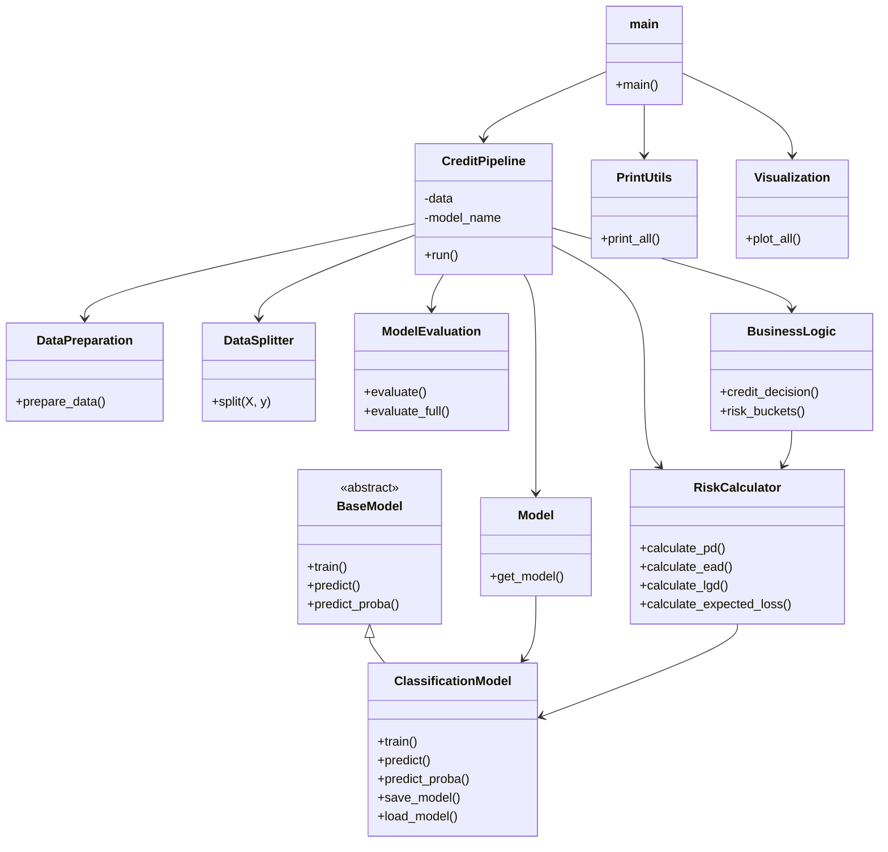
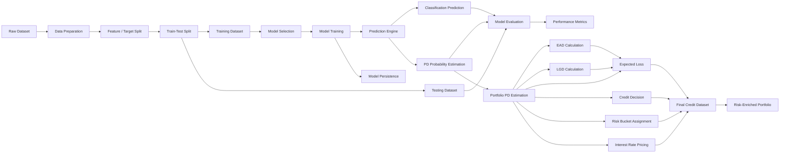

# Credit Model
### Credit Models project

**Author:** 
  - José Armando Melchor Soto
  - Rolando Fortanell Canedo
  - David Campos Ambriz 


**Course:** Credit Models  
**Institution:** ITESO  

---

## Table of Contents


---
## Overview

---

## Architecture

### Project Structure


### Functional Architecture

### OOP Architecture


### Loan Lifecycle


### Flow Diagram





---


## Installation

```bash
# 1. Clone the repository
git clone https://github.com/ppmelch/Credit_Model.git
cd Credit_Model

# 2. Create and activate a virtual environment
python -m venv .venv
source .venv/bin/activate      # macOS / Linux
.venv\Scripts\activate         # Windows

# 3. Install dependencies
pip install -r requirements.txt
```

---

## Usage

---

## Results

---

## Discussion

---

## Assumptions

---

## Limitations

---


## Conclusions

---


## Output

---


## Documentation

The full project report is available at:

- [Credit Model Report](docs/Credit_Model.pdf)

---

## License

This project is licensed under the **MIT License** — see [LICENSE](LICENSE) for details.
